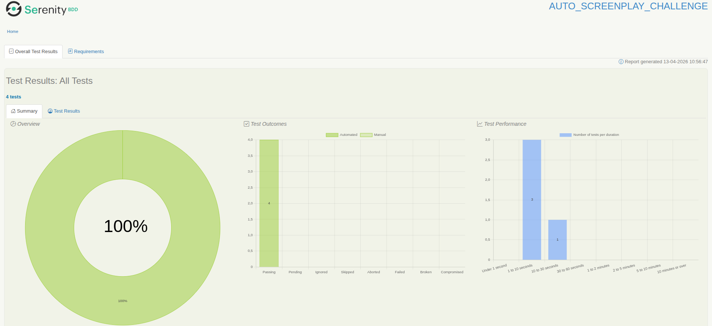
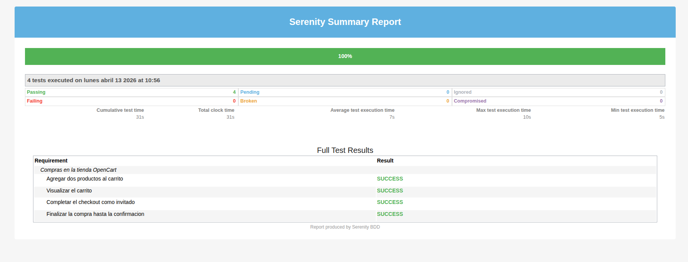

# AUTO_SCREENPLAY_CHALLENGE

Proyecto de automatización de pruebas para la tienda [OpenCart](http://opencart.abstracta.us/) utilizando el patrón **Screenplay** con **Serenity BDD**, **Cucumber** y **Java 21**.

## Estructura del proyecto

```
src/
├── java/com/products/
│   ├── hooks/              # Configuración del actor (OnStage)
│   ├── questions/          # Preguntas del patrón Screenplay
│   ├── runners/            # Runner de Cucumber con JUnit Platform
│   ├── stepdefinitions/    # Definiciones de pasos Cucumber
│   ├── tasks/              # Tareas del patrón Screenplay
│   └── ui/                 # Targets (localizadores de elementos)
└── resources/
    ├── features/           # Archivos .feature (Gherkin)
    ├── serenity.conf       # Configuración de Serenity y WebDriver
    └── logback-test.xml    # Configuración de logging
```

## Escenarios de prueba

1. **Agregar dos productos al carrito** — Agrega MacBook e iPhone y valida que el carrito muestra 2 productos.
2. **Visualizar el carrito** — Agrega productos, navega al carrito y verifica que cada producto es visible.
3. **Completar el checkout como invitado** — Realiza el flujo de checkout como invitado hasta el paso de método de pago.
4. **Finalizar la compra hasta la confirmación** — Completa todo el flujo de compra y verifica el mensaje "Your order has been placed!".

## Requisitos previos

- **Java 21** (JDK)
- **Google Chrome** (instalado en el sistema)
- **Gradle 9.2** (incluido con el wrapper `gradlew`)

## Ejecución de las pruebas

1. Clonar el repositorio:

   ```bash
   git clone <url-del-repositorio>
   cd AUTO_SCREENPLAY_CHALLENGE
   ```

2. Ejecutar las pruebas:

   ```bash
   ./gradlew clean test
   ```

3. Los reportes se generan automáticamente al finalizar la ejecución:

- **Reporte HTML completo:** `target/site/serenity/index.html`
  

- **Resumen en una página:** `target/site/serenity/serenity-summary.html`
  

## Tecnologías utilizadas

| Tecnología     | Versión |
| -------------- | ------- |
| Java           | 21      |
| Serenity BDD   | 5.3.2   |
| Cucumber       | 7.34.2  |
| JUnit Platform | 1.13.0  |
| Gradle         | 9.2     |
